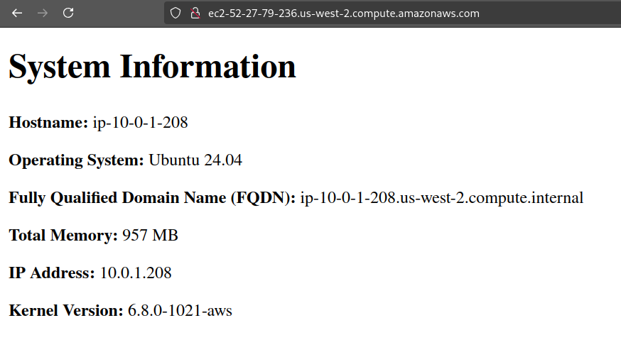

## Lab 7 Commands

### Creating an SSH keypair

To begin, create an ED25519 public/private key pair. This command specifies the key type as ED25519 and outputs both the private ``aws`` key and the public ``aws.pub`` key in ``~/.ssh/``

```bash
ssh-keygen -t ed25519 -f ~/.ssh/aws
```

### Upload the key to your AWS account

Use the provided ``import_lab_key`` script to upload the previously created public key to your AWS account:

```bash
./scripts/import_key_file
```

### Terraform

Run the following command to initialize your Terraform project and install the required Terraform AWS provider.

```bash
terraform init
```

Validate the Terraform plan for good practice:

```bash
terraform validate
```

Given succesful validation, apply the Terraform plan:

```bash
terraform apply
```

The console will then output the domain name and IPv4 address of the two created EC2 instances. Save these for later.

## Ansible

Begin by opening your Ansible playbook, and make the following changes:

```yaml
- name: Configure web servers
  # Apply this plan to all hosts in the specified inventory
  hosts: all
  # Execute commands as a privileged user (root)
  become: yes
  tasks:
    - name: Install nginx
      # Use package module
      package:
        # Control nginx package
        name: nginx
        # Make sure it's installed
        state: present
    
    - name: create directory structure for web documents
      # Use file module
      file:
        # Working directory (from files/nginx.conf)
        path: /web/html/
        state: directory
        # chown the directory to www-data (default nginx service account)
        owner: www-data
        group: www-data
        # Restrict write access to file owner
        mode: '0755'

    - name: copy nginx conf file to server
      # Use the copy module
      copy:
        src: files/nginx.conf
        dest: /etc/nginx/sites-available/default
        # chown to root
        owner: root
        group: root
        # No execute, restrict write to file owner
        mode: '0644'
        
    - name: create link to nginx config file to enable it
      # File module
      file:
        # Symlink the configuration from -available to -enabled
        src: /etc/nginx/sites-available/default
        dest: /etc/nginx/sites-enabled/default
        state: link
        
    - name: Generate index.html file from template
      # Use template module to process Jinja2 templates
      template:
        src: templates/index.html.j2
        dest: /web/html/index.html
        # chown to www-data
        owner: www-data
        # no execute, writeable only by owner
        group: www-data
        mode: '0644'
        
    - name: reload nginx service
      # Use service module
      service:
        name: nginx
        # Reload the service
        state: reloaded
        # Ensure nginx is enabled
        enabled: yes
```

Then, edit ``ansible/inventory/hosts.yml`` as follows:

```yaml
all:
  # Add common SSH variables to disable host key checking and send remote host keys to /dev/null
  vars:
    ansible_ssh_common_args: '-o StrictHostKeyChecking=no -o UserKnownHostsFile=/dev/null'
  children:
    web:
      hosts:
        server-one:
          # Server host name
          ansible_host: ec2-52-27-79-236.us-west-2.compute.amazonaws.com
          # User to connect over SSH with
          ansible_user: ubuntu
          # Private key file to use for SSH authentication
          ansible_ssh_private_key_file: ~/.ssh/aws
          
        server-two:
          # Server host name
          ansible_host: ec2-34-220-217-170.us-west-2.compute.amazonaws.com
          # User to connect over SSH with
          ansible_user: ubuntu
          # Private key file to use for SSH authentication
          ansible_ssh_private_key_file: ~/.ssh/aws
```

Run the following command to test connectivity with the target hosts in your Ansible inventory:

```bash
ansible all -i inventory/hosts.yml -m ping
```

You should get the following back, indicating successful connection:

```bash
[WARNING]: Platform linux on host server-one is using the discovered Python interpreter at /usr/bin/python3.12,
but future installation of another Python interpreter could change the meaning of that path. See
https://docs.ansible.com/ansible-core/2.18/reference_appendices/interpreter_discovery.html for more information.
server-one | SUCCESS => {
    "ansible_facts": {
        "discovered_interpreter_python": "/usr/bin/python3.12"
    },
    "changed": false,
    "ping": "pong"
}
[WARNING]: Platform linux on host server-two is using the discovered Python interpreter at /usr/bin/python3.12,
but future installation of another Python interpreter could change the meaning of that path. See
https://docs.ansible.com/ansible-core/2.18/reference_appendices/interpreter_discovery.html for more information.
server-two | SUCCESS => {
    "ansible_facts": {
        "discovered_interpreter_python": "/usr/bin/python3.12"
    },
    "changed": false,
    "ping": "pong"
}
```

It's good practice to validate your Ansible playbook syntax before running it:

```bash
ansible-playbook playbook.yml --syntax-check
```

It should respond with the name of the playbook and nothing else if the check is successful.

Now, it's time to run the playbook. Remember the ``--become`` option to run the commands as root (required since our playbook has the ``become: yes`` flag in some task blocks)
Also, point Ansible to your host inventory with the ``-i inventory/hosts.yml`` option.

```bash
ansible-playbook -i inventory/hosts.yml playbook.yml --become
```

You should see output for each task, with the outcome of that task on each host individually. At the end of the output, you should see a "play recap" that details the outcome of all tasks, similar to the following:

```bash
PLAY RECAP ********************************************************************************************************
server-one                 : ok=7    changed=1    unreachable=0    failed=0    skipped=0    rescued=0    ignored=0   
server-two                 : ok=7    changed=1    unreachable=0    failed=0    skipped=0    rescued=0    ignored=0
```

This indicates that Ansible successfully configured the hosts in your inventory with the tasks defined in your playbook.
